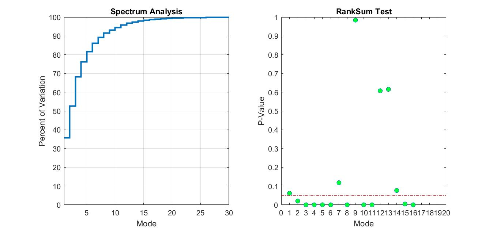
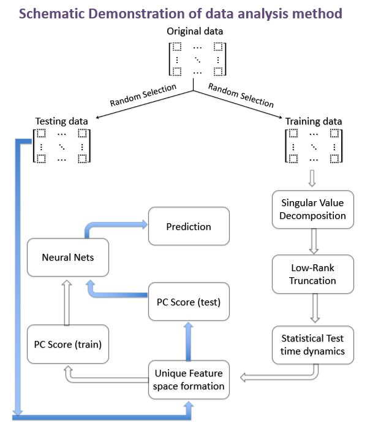
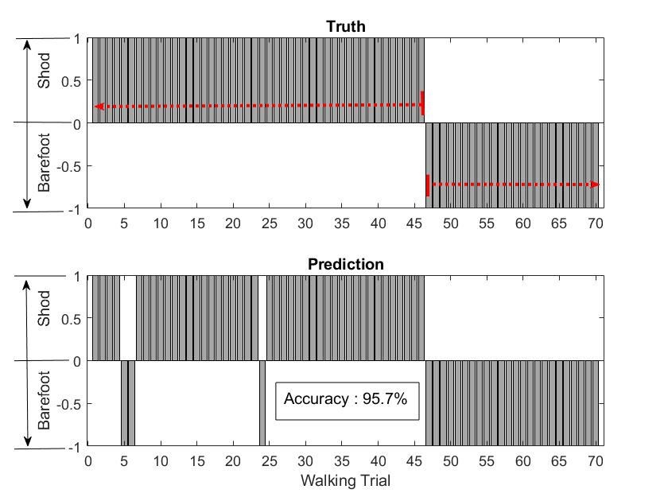

# Gait Recognition Using Neural Network 
<p>This project was presented at the poster session of 2019 Physics-Informed Machine Learning workshop in Seattle, WA.</p><br>
<p> Gait analysis is the popular field in clinical research and biomechanical research. Earliest history of gait analysis dates back to Aristole, who observed people walk with his naked eye. Nowadays, with the aid of modern motion capaturing system and wireless sensors, researcher is able to obtain massive amount of data in a single data collection session. Therefore, the problem every researcher facing now is how to extract meaningful information from the piles of biomechancial data. Machine learning, on the other hand, is one of the fastest growing fields in data science, and has been used extensively in business setting. The goal of this project is to classify the walking status (shod walking vs. barefoot walking) using neural network algorithms. Clinically, classification of gait may be questionable; however, what researcher should focus on is the data mining techniques used here.<p><br>

<p><b>This project is advised by Dr. Patricia Kramer and Dr.Nathan Kutz. Dr. Patricia Kramer is the chair and professor of Dept. of Anthropology at Univeristy of Washington; Dr.Nathan Kutz is the professor of Applied Mathematics.</b></p>

## Raw Data Visualization 
<p>The raw dataset contains 396 stride cycles of shod walking and 374 stride cycle of barefoot walking, which was collected from 20 female subjects. The raw data is confidential, but you can get some idea from the following plot 


<p><em>from the plot, we found that the kinematics between shod walking and barefoot walking has very similar shape of graph. Although some differences can be spotted in the average plot in the third column, remeber this is the average plot and there are individual difference and variability between subject. Therefore, what set two walking status apart is not the magnitude of the plot, but the time evolution</em></p>

## Data Preprocessing
<p><b>Training-Testing Data Split:</b> I randomly select 350 stride cycles from each walking satus, altogether 700 stride cycle is combined for model training. This training dataset is a 100*700 matrix. The rest will be utilitzed for model testing.</p>

```matlab
index1=randperm(396,350);
index2=randperm(374,350);

index1_c=~ismember(1:396,index1); % c means for testing
index2_c=~ismember(1:374,index2);

a=[x2(:,index1)  x5(:,index2)];    % training data
b_knee=[x2(:,index1_c) x5(:,index2_c)]; % testing data
```

<p><b>Dimension reduction with PCA:</b> as one typical example of high-dimensional dataset (100 time slot), it is critical to use PCA to reduce the dimension of dataset by selecting the mode, or principle components that are most different between the two walking status. Here, i perform the spectral analysis on singular value first and retained the 95% modes. Then, i select the principal component using ranksum test

```matlab
[U,S,V]=svd(data-mean(data,2));
```


<p>Based on spectral analysis, we can low-rank truncate the dataset matrix from 100 dimensions to 10 dimensions. Then based on the the RankSum test, we can further eliminate 2 dimensions. In the end, we retain only 8 modes, or principal component, for the future analysis.</p><br>

## Neural Net Training
<p>Training a neural net is the jargon used in Machine Learning Scientist, it is equivalent to model development in statistican community. I train the neural nets with PC-score rather than the original kinematics dataset. PCA is nothing but the the chagne of corrdinate system. The reason we need to change the coordinate system from the orginal carteasin space to eigenvector space is because eigenspace is a better representation of the dataset. Therefore, eigenspace is the feature space of the dataset, and we need to train the neural net with PC score.</p>

```matlab
net = feedforwardnet([45 8 43]);
net.layers{1}.transferFcn = 'logsig';
net.layers{2}.transferFcn = 'radbas';
net.layers{3}.transferFcn = 'purelin';
net = train(net,input,output);
```
<br>

## Prediction With the Trained Neural Nets
<p>Once the neural nets is trained, we can test it with the testing dataset. Remeber you need to covert you dataset to PC-score first. You can also play around with my trained neural nets: net_ankle.mat,net_knee.mat, net_hip.mat. This method yield very good prediction accuracy.</p>


<h3>Prediction using knee kinematics</h3>

<br><br>
<p><b>True positive(shod):</b>43/46= 93.5%</p>
<p><b>True negative(barefoot):</b>24/24=100%</p>


