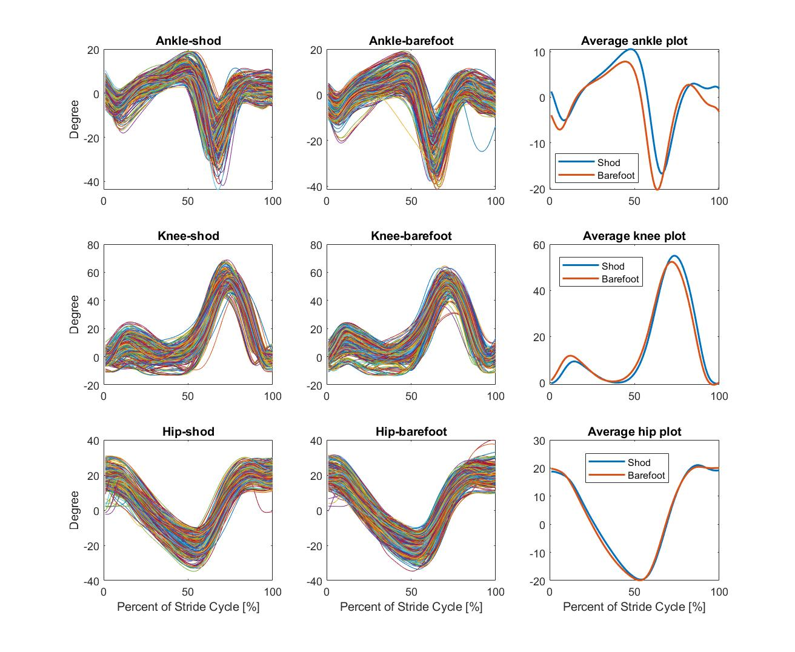

# Gait Recognition Using Neural Network 
<p>This project is presented at the poster session of 2019 Physics-Informed Machine Learning workshop in Seattle, WA.</p><br>
<p> Gait analysis is one of the popular topics that are used in clinical research and biomechanical research. Earliest history of gait analysis dates back to Aristole, who observed people walking with bare eye. Nowadays, with the aid of modern motion capaturing system and wireless sensors, researcher is able to obtain massive amount of data in a single data collection session. Therefore, the problem of how to collect more data from subject become how to extract meaningful information from the data.</p><br>
<p> Machine learning is one of the fastest growing fields in data science, and has been used extensively in business setting. The goal of this project is to classify the walking status (shod walking vs. barefoot walking) using neural network algorithms. <p><br>

## Raw Data Visualization 
<p>The raw dataset contains 396 stride cycles of shod walking and 374 stride cycle of barefoot walking, which was collected from 20 female subjects. The raw data is confidential, but you can get some idea from the following plot 


<p><em>from the plot, we found that the kinematics between shod walking and barefoot walking has very similar shape of graph. Although some differences can be spotted in the average plot in the third column, remeber this is the average plot and there are individual difference and variability between subject. Therefore, what set two walking status apart is not the magnitude of the plot, but the time evolution</em></p>

## Data Preprocessing
<p><b>Training-Testing Data Split:</b> I randomly select 350 stride cycles from each walking satus, altogether 700 stride cycle is combined for model training. This training dataset is a 100*700 matrix. The rest will be utilitzed for model testing.</p>\

```matlab
index1=randperm(396,350);
index2=randperm(374,350);

index1_c=~ismember(1:396,index1); % c means for testing
index2_c=~ismember(1:374,index2);

a=[x2(:,index1)  x5(:,index2)];    % training data
b_knee=[x2(:,index1_c) x5(:,index2_c)]; % testing data
```

<p><b>Dimension reduction with PCA:</b> as one typical example of high-dimensional dataset (100 time slot), it is critical to use PCA to reduce the dimension of dataset by selecting the mode, or principle components that are most different between the two walking status. Here, i perform the spectral analysis on singular value first and retained the 95% modes. Then, i select the principal component using ranksum test

```matlab
[U,S,V]=svd(data-mean(data,2));
```
<figure>

<figcaption>Spectral analysis using singular value. We will retain 10 modes here</figcaption>
</figure>

<figure>

<figcaption>We further eliminate 2 modes here. Therefore, 100 dimension is reduced to 8 dimensions here</figcaption>
</figure>
